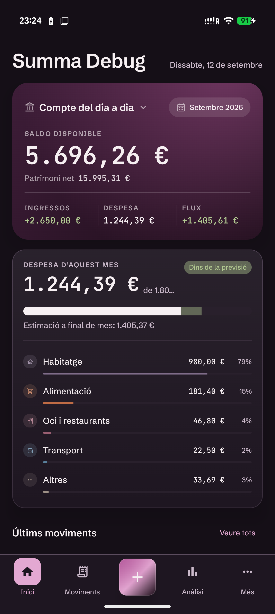
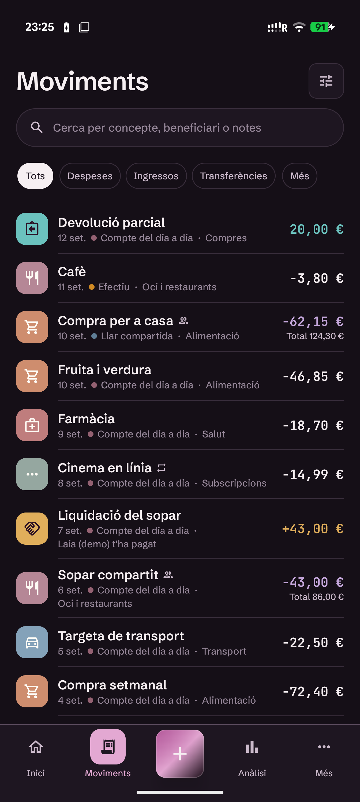
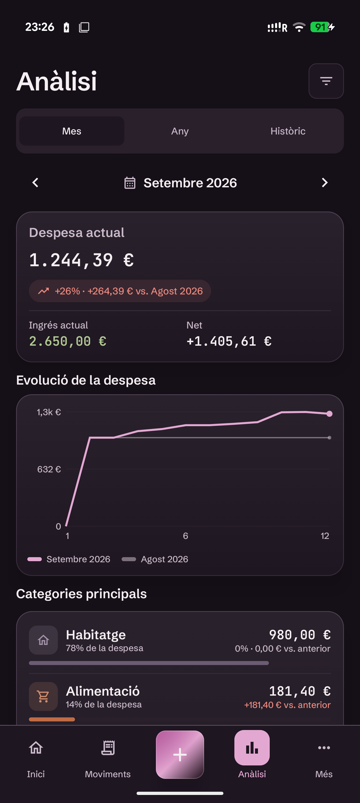
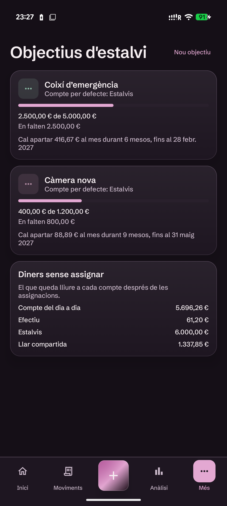
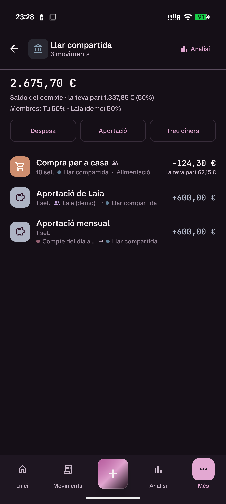
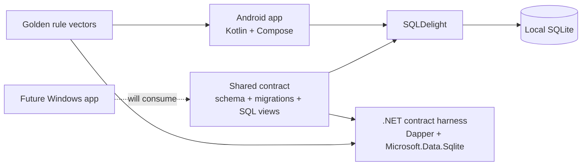

# Summa

[](#project-status)
[](https://github.com/Nilpomarol/Gestor-finances-V7/actions/workflows/ci.yml)
[](#technology)
[](#architecture)
[](#ai-developed-human-directed)

Summa is a functional, local-first Android personal finance application for one person. It is built for people who want a detailed and explainable view of their money without sending their financial history to a hosted service or depending on a bank connection.

The app brings account flow, actual income and spending, shared expenses and debts, recurring activity, budgets, savings goals, and trip spending into one ledger. Its interface is Catalan and its accounting is euro-only. A future Windows application will consume the same financial contract; today, the Windows project is a .NET validation harness rather than a user-facing app.

> [!IMPORTANT]
> The Android app is working and already implements most of its intended day-to-day flows, but Summa remains a personal project in active development. Some features still require device verification, investment valuation is not implemented, and there is no public production release or app-store distribution yet.

## The problem it tries to solve

Many expense trackers record transactions but blur together different financial meanings. Money leaving an account is not always personal spending; a shared purchase is not necessarily yours in full; a transfer is not income; a refund changes the economic cost of an earlier expense; and assigning existing savings to a goal should not change net worth.

Summa is designed to keep those meanings separate while still making them understandable in one app:

- **Account flow** explains what physically entered or left an account.
- **Actual income and expense** explain what economically belongs to the app owner.
- **Shared expenses and settlements** derive who owes whom without storing an editable debt balance.
- **Budgets and forecasts** use the same actual-spending rules as the rest of the product.
- **Savings goals** reserve existing money without inventing ledger activity.
- **Trips, tags, categories, and analysis** add context without creating competing versions of the totals.

The result is intended to be a private financial tool whose numbers can be traced back to explicit rules rather than unexplained calculations in individual screens.

## Demo

These are captures of the real Android debug build, not design mockups. The app was loaded with a reproducible synthetic portfolio database generated by [`tools/create_portfolio_demo_db.py`](tools/create_portfolio_demo_db.py).

No screenshot, recording, fixture, or example intended for this repository contains the maintainer's real accounts, balances, movements, people, or other personal financial information.

<table>
  <tr>
    <td align="center"><strong>Dashboard and budget forecast</strong></td>
    <td align="center"><strong>Unified movement ledger</strong></td>
  </tr>
  <tr>
    <td></td>
    <td></td>
  </tr>
  <tr>
    <td align="center"><strong>Period analysis and comparison</strong></td>
    <td align="center"><strong>Savings goals</strong></td>
  </tr>
  <tr>
    <td></td>
    <td></td>
  </tr>
</table>

The synthetic dataset also exercises shared-account ownership, contributions, and the distinction between an account's full balance and the owner's economic share:

<p align="center">
  
</p>

## What works today

The Android application currently supports:

- accounts, opening balances, transfers, expenses, income, refunds, and settlements;
- hierarchical categories, tags, search, and movement filters;
- people, split expenses, shared accounts, contributions, and derived debts;
- recurring templates, due-item confirmation, skipping, and recurrence suggestions;
- monthly and yearly budgets with forecasts and configurable inclusion rules;
- trips, trip budgets, scoped tags, and trip analysis;
- savings goals backed by dedicated accounts or planning allocations;
- dashboard and period-based financial analysis;
- light, dark, and system themes, local notifications, and local backup/restore.

The interface follows a completed Android design baseline called **Personal Compass**: warm, private, precise, and evidence-led. Financial meaning is always labelled and never communicated by colour alone.

## Why the implementation is interesting

Personal finance software can look correct while producing subtly inconsistent numbers. Summa therefore treats financial semantics as a data-contract problem:

- Money is stored as integer euro cents, never floating point.
- Balances, account flow, actual income and expense, debt, goal progress, and trip totals come from canonical SQLite views.
- Schema and set-based finance logic are single-sourced under `shared/` and consumed by both platform harnesses.
- Procedural rules are implemented natively in Kotlin and C#, then checked against the same JSON golden vectors.
- Database changes include ordered migrations and parity validation instead of platform-specific schema forks.
- Risky but valid actions produce understandable warnings; structurally invalid ledger states remain errors.
- Normal financial deletion is recoverable soft deletion.

This makes the repository both an Android application and an exercise in maintaining one explainable financial contract across native platforms.

## Architecture



Android follows a straightforward dependency direction:

```text
Compose screen -> ViewModel/state -> domain rule or repository -> SQLDelight -> SQLite
```

There is no server in the current product. Each installation owns a local SQLite database, and Android is currently the only working product surface. The longer-term synchronization design is documented but not implemented.

More detail is available in [Architecture](docs/architecture.md) and [Data contract](docs/data-contract.md).

## Technology

| Area | Technology |
| --- | --- |
| Android | Kotlin, Jetpack Compose, Material 3, coroutines, StateFlow |
| Persistence | SQLite and SQLDelight |
| Shared contract | SQL schema, migrations, canonical queries, JSON golden vectors |
| Windows validation | .NET 8, C#, Microsoft.Data.Sqlite, Dapper, MSTest |
| Automation | Gradle, Python validation scripts, GitHub Actions |
| Design system | Shared JSON tokens mapped to native UI semantics |

## AI-developed, human-directed

Summa has been developed entirely using **OpenAI Codex** and **Anthropic Claude Code**. The application code, SQL contract, migrations, tests, design work, and technical documentation have all been produced through AI coding-agent workflows.

The project is **human-directed**: the maintainer defines the problem, chooses the product direction, establishes and approves financial behaviour, tests the app in real use, supplies acceptance decisions, and decides which generated changes become part of the repository. It is not presented as software manually implemented by the maintainer.

The repository keeps its agent guidance and specialist configurations visible in [`AGENTS.md`](AGENTS.md), [`.codex/agents`](.codex/agents), and [`.claude/agents`](.claude/agents) so that this development method is inspectable rather than hidden.

AI assistance does not replace verification: financial rules are encoded in shared fixtures, platform parity is tested, and presentation-sensitive changes require manual device checks.

## Project status

Summa remains under active development:

- **Android:** working primary application; ongoing product work and device verification remain.
- **Shared contract:** active schema, migrations, canonical finance queries, and golden vectors.
- **Windows:** contract test harness only; the WinUI application has not been built.
- **Synchronization:** designed for later work, not implemented.
- **Distribution:** no public production release or app-store package yet.

Current work follows the ordered [pre-Windows plan](docs/pre-windows-plan.md). The repository does not need the future Windows application to demonstrate the Android product, but planned capabilities are deliberately not described as finished features.

## Build and test

### Requirements

- JDK 17
- Android SDK 35 with Build Tools 35.0.0
- .NET 8 SDK for the shared-contract harness

### Android

From `android/`:

```powershell
.\gradlew.bat :app:assembleDebug
.\gradlew.bat :app:testDebugUnitTest
```

The debug build uses a separate application ID so it can be installed beside a release build without opening or replacing the release database.

### Windows/shared contract

From the repository root:

```powershell
dotnet test .\windows\GestorFinances.Tests\GestorFinances.Tests.csproj
```

GitHub Actions builds and tests Android, runs the .NET contract suite, validates golden fixtures, checks shared SQL, verifies Android/Windows SQL wiring, and validates the shared design tokens. Any failing golden or parity check blocks delivery of a financial-rule change.

## Repository map

```text
android/   Native Android application and tests
windows/   .NET shared-contract test harness; future Windows application
shared/    Schema, migrations, canonical SQL, golden vectors, schemas, and tokens
docs/      Product, architecture, data, design, and roadmap contracts
tools/     Repository validation scripts
```

## Documentation

- [Product](docs/product.md) — implemented capabilities and durable financial behaviour
- [Data contract](docs/data-contract.md) — schema, canonical SQL, migrations, and golden rules
- [Architecture](docs/architecture.md) — native boundaries, backup, and future synchronization
- [Design](docs/design.md) — Android design baseline and interaction principles
- [Pre-Windows plan](docs/pre-windows-plan.md) — active product gates before desktop development
- [Windows plan](docs/windows-plan.md) — intended desktop implementation sequence
- [Agent guide](AGENTS.md) — project invariants and AI-assisted working rules

## Scope and limitations

Summa is intentionally single-owner, euro-only, Catalan-first, and local-first. It has no authentication, hosted account, live bank connection, investment-price feed, or implemented cross-device synchronization. Android backups are local, user-directed database snapshots and are currently unencrypted.

The project is being developed for personal use and portfolio review. No open-source licence has been selected yet; unless a licence is added, the source should not be assumed to grant reuse or redistribution rights.
