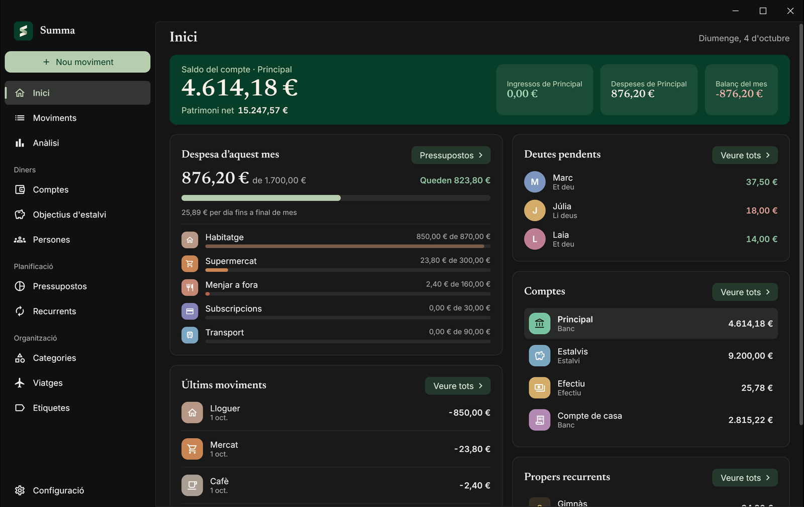
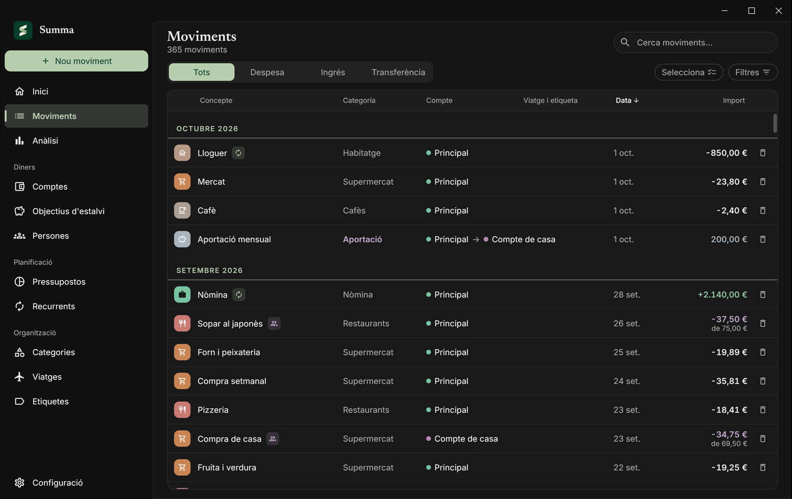
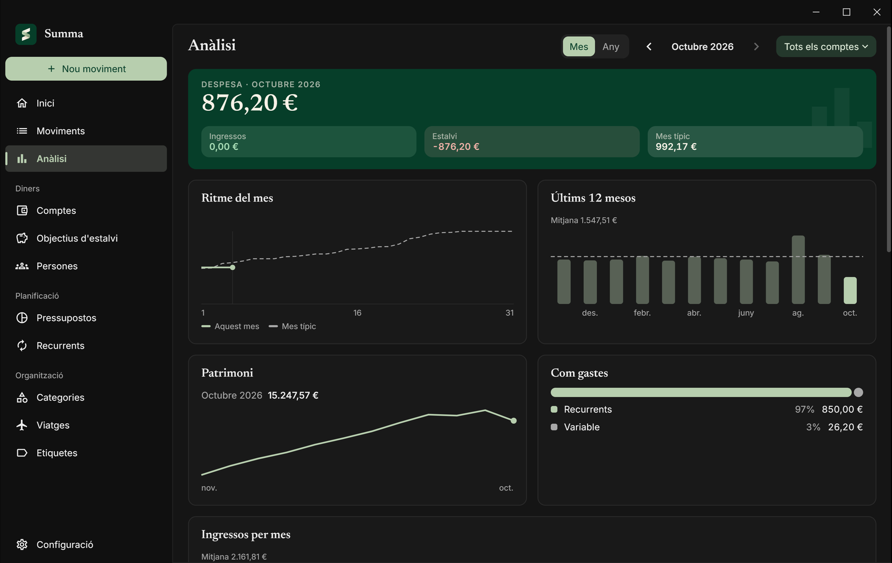
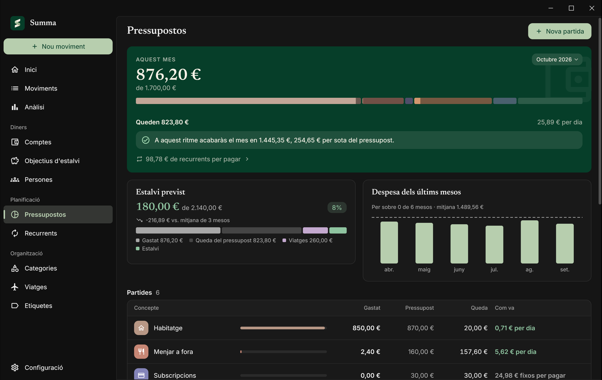
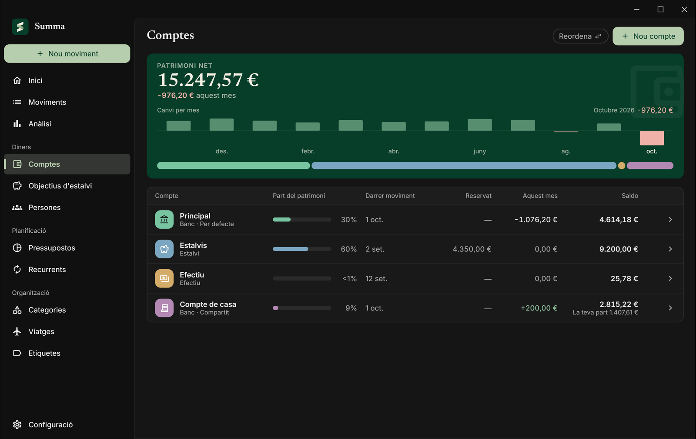
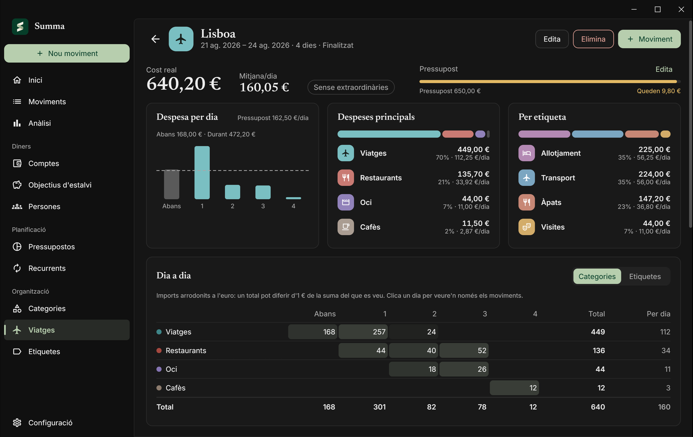

# Summa

Summa is a local-first personal finance app for one person, on Android and on Windows. It is Catalan-first, euro-only, and designed to keep financial meanings explicit without requiring a hosted account, bank connection, or cloud database.

> [!NOTE]
> **Status: complete.** Version 1.1 does what the project set out to do: an Android app in daily use by its maintainer, a Windows desktop app on the same data and rules, and synchronization between the two over the local Wi-Fi. No further features are planned; what could come later is listed under [Possible future work](#possible-future-work). A signed APK for Android 8.0 or later and an unsigned Windows installer are attached to the repository's [Releases](https://github.com/Nilpomarol/Summa/releases); Summa is not on any app store.

## What it tracks

Summa distinguishes concepts that many expense trackers collapse together:

- **Account flow** — what physically entered or left an account.
- **Actual income/expense** — what economically belongs to the app owner.
- **Shared expenses and debt** — economic splits and derived balances between people.
- **Shared accounts** — physical balance, ownership share, contributions/withdrawals, and expense allocation.
- **A monthly budget** — one total split into category parts that always add up to it, with pace, forecast and what is left per day, measured against canonical actual spending.
- **Savings goals** — reservations of existing money without inventing ledger activity.
- **Trips, categories, tags, recurring activity, and analysis** — context over the same financial truth.

## The Android app

- personal and shared accounts;
- expenses, income, transfers, refunds, settlements, contributions, and withdrawals;
- people, splits, shared income allocation, and derived debt;
- recurring payments and income as expected movements: a reminder ahead of the date, on the day and when one is missed, confirmed in one sheet or matched to a movement recorded by hand;
- a monthly budget in parts, with its history kept month by month, planned saving, yearly category limits and trip budgets;
- trips with spending per day, categories with subcategories, tags, search, and filters;
- savings goals backed by dedicated accounts or manual allocations;
- a home page for the month and an analysis page for where money goes, the month's pace, the last twelve months and net worth;
- System/Light/Dark themes and notifications that each can be turned off;
- automatic backups to a folder of your choice, pruned to the recent ones, and restore that first backs up what it replaces.

The UI follows the **Personal Compass** direction: warm, private, precise, and evidence-led. Financial meaning is labelled rather than conveyed by colour alone.

## The Windows desktop app

The same data, finance rules and Catalan UI as the phone, laid out for a wide window rather than stretched from it:

- a navigation pane, tables with sortable columns, and a full page for each account, person, trip, category, tag, goal and recurring item;
- an account's ledger as a statement with the balance each movement left;
- month-by-month tables in Analysis and Budgets that the phone has no room for, with figures that open their movements;
- several movements deleted or filed at once, and a panel of filters that add up;
- keyboard shortcuts for a new movement and for the pages, and a movement form that saves from the keyboard;
- backups to a folder of your choice, restore of a backup made on either device, and a copy kept of whatever a restore or a schema migration replaces;
- System/Light/Dark themes.

It is written in Kotlin with Compose Desktop on the same `core` and `ui` modules as the phone, so repositories, finance rules, ViewModels and forms are shared rather than written twice.

## Synchronization

The phone and the computer are paired once with a code the computer shows. From then on they merge record by record whenever both are open on the same Wi-Fi: no server, no account, and nothing leaves the local network. Records that only make sense together travel together (a movement with its split, an account with its members). Only a record changed on both devices is put to the owner, and a merge that would break a shared account's rules is refused whole rather than applied in part.

## Demo

Every screenshot shows invented data: a year of a made-up person's ledger generated by [`tools/create_portfolio_demo_db.py`](tools/create_portfolio_demo_db.py) and loaded into a separate install of the app. The repository contains none of the maintainer's real financial data.

### Android

<table>
  <tr>
    <td></td>
    <td></td>
    <td></td>
    <td></td>
  </tr>
  <tr>
    <td align="center">Home</td>
    <td align="center">Monthly budget</td>
    <td align="center">Analysis</td>
    <td align="center">Recurring</td>
  </tr>
  <tr>
    <td></td>
    <td></td>
    <td></td>
    <td></td>
  </tr>
  <tr>
    <td align="center">Trip</td>
    <td align="center">Shared account</td>
    <td align="center">Savings goals</td>
    <td align="center">Dark theme</td>
  </tr>
</table>

### Windows

<table>
  <tr>
    <td></td>
    <td></td>
  </tr>
  <tr>
    <td align="center">Home</td>
    <td align="center">Movements</td>
  </tr>
  <tr>
    <td></td>
    <td></td>
  </tr>
  <tr>
    <td align="center">Analysis</td>
    <td align="center">Monthly budget</td>
  </tr>
  <tr>
    <td></td>
    <td></td>
  </tr>
  <tr>
    <td align="center">Accounts</td>
    <td align="center">Trip</td>
  </tr>
</table>

## Architecture

Both apps share one shape:

```text
Compose UI
    ↓
ViewModel / screen state
    ↓
repository or small domain rule
    ↓
SQLDelight
    ↓
SQLite
```

`shared/` contains the schema, migrations, genuinely canonical finance SQL, focused golden vectors, and design tokens. Under `android/`, `core` holds the SQLDelight bindings, repositories, finance rules, backup and sync; `ui` (Kotlin Multiplatform) holds the theme, shared components, ViewModels and every string; `app` is the Android app and `desktop` the Windows one. The `windows/` project is only a .NET harness that validates the shared contract.

There is no server: the phone and the computer merge their records directly over the local network. The desktop app and synchronization are described in [`docs/future/windows.md`](docs/future/windows.md) and [`docs/future/sync.md`](docs/future/sync.md).

## Technology

| Area | Technology |
| --- | --- |
| Android | Kotlin, Jetpack Compose, Material 3, coroutines, StateFlow |
| Windows | Kotlin, Compose Desktop on the same shared modules; MSI installer through jpackage |
| Sync | Record-level three-way merge over the local network, AES-GCM with a key derived from the pairing code |
| Persistence | SQLite, SQLDelight |
| Shared finance contract | SQL schema, migrations, canonical queries, JSON golden vectors |
| Contract validation | .NET 8, C#, Microsoft.Data.Sqlite, Dapper, MSTest |
| Automation | Gradle, Python validation scripts, GitHub Actions |

## Financial correctness

- Money is stored as integer euro cents.
- Balances, account flow, actual income/expense, debt, trip actuals, and goal progress are derived from canonical SQL.
- Schema changes use forward migrations.
- Focused procedural finance rules use shared golden vectors where exact parity matters.
- Risky but valid actions warn; structurally invalid ledger states remain errors.
- Normal finance deletion is recoverable soft deletion.

## AI-developed, human-directed

Summa has been developed using OpenAI Codex and Anthropic Claude Code. The maintainer defines product behaviour, approves financial semantics, tests real flows, and decides which generated changes are accepted.

Repository-level agent guidance lives in [`AGENTS.md`](AGENTS.md). Optional specialist configurations are intentionally minimal: a reviewer and a schema steward for changes where they materially reduce risk.

## Build and test

Requirements: JDK 17, Android SDK 35 / Build Tools 35.0.0, and .NET 8 SDK when validating the shared contract.

Android, from `android/`:

```powershell
.\gradlew.bat :app:assembleDebug
.\gradlew.bat :core:test :ui:desktopTest :app:testDebugUnitTest
```

Desktop app, from `android/`:

```powershell
.\gradlew.bat :desktop:test
.\gradlew.bat :desktop:run
.\gradlew.bat :desktop:packageMsi   # needs a full JDK 17+ with jpackage
```

.NET contract harness, from the repository root:

```powershell
dotnet test .\windows\GestorFinances.Tests\GestorFinances.Tests.csproj
```

## Repository map

```text
android/       core, ui, app (Android) and desktop (Windows) modules, with their tests
windows/       .NET shared-contract validation harness
shared/        Schema, migrations, canonical finance SQL, golden vectors, tokens
docs/          Current product/architecture/design/data docs and backlog
docs/future/   The desktop app and sync as built
tools/         Validation and demo-data scripts
```

## Documentation

- [Product](docs/product.md) — current capability and durable finance meanings
- [Architecture](docs/architecture.md) — modules, boundaries and data flow
- [Data contract](docs/data-contract.md) — current schema/finance contract
- [Design](docs/design.md) — durable Android design principles
- [Backlog](docs/backlog.md) — what was left open
- [Desktop app](docs/future/windows.md) and [sync](docs/future/sync.md) — how each is built
- [Agent guide](AGENTS.md) — repository-level coding-agent instructions

## Scope

Summa is intentionally single-owner, euro-only, Catalan-first, and local-first. It has no authentication, hosted account, live bank connection, or synchronization beyond the owner's own phone and computer on the same network.

## Possible future work

The project is complete as scoped. None of the following is planned or promised; they are directions it could grow in:

- **Investments** — holdings, trades and valuations alongside cash accounts, so net worth includes them.
- **Currencies** — accounts and movements in currencies other than the euro, with conversion.
- **Bank import** — reading a bank's CSV export on the desktop instead of typing movements.
- **Sync away from home** — keeping the devices in step when they are not on the same network.
- **A signed Windows installer** — so Windows does not warn before running it.

No open-source licence has been selected yet; unless a licence is added, the source should not be assumed to grant reuse or redistribution rights.
