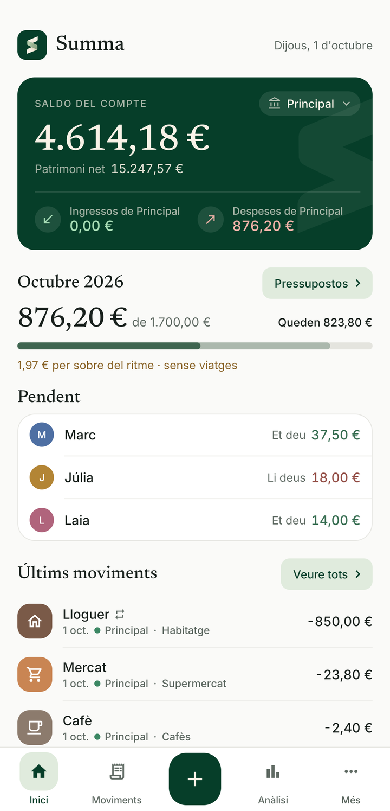
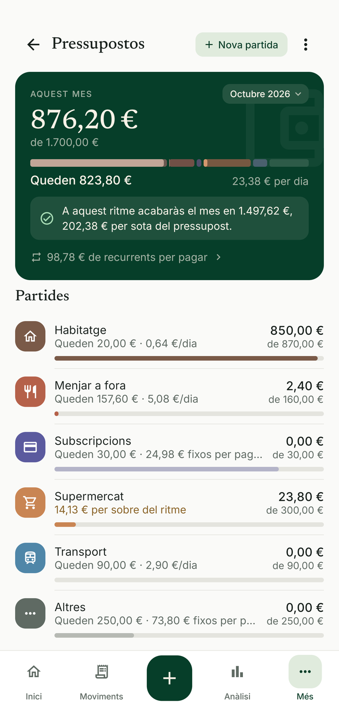
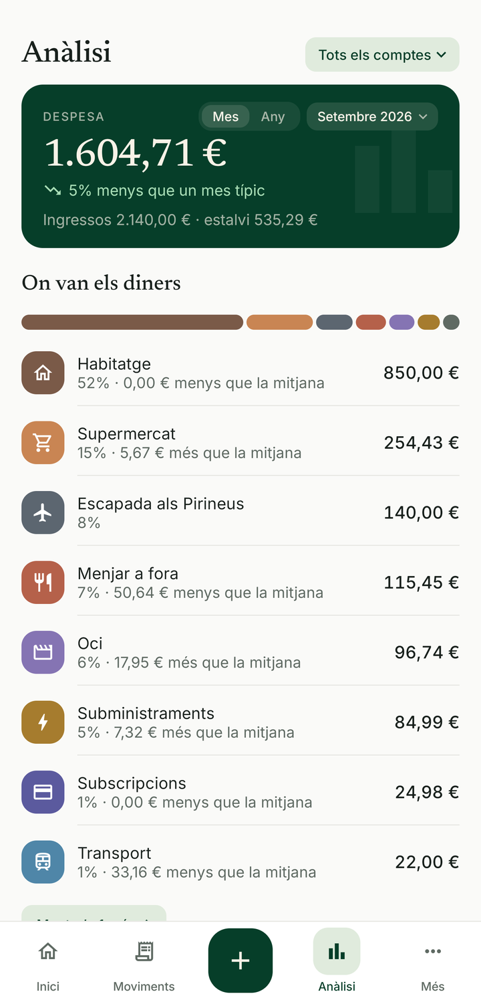
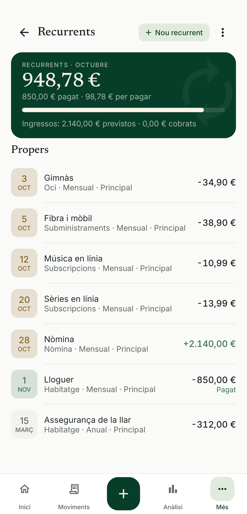
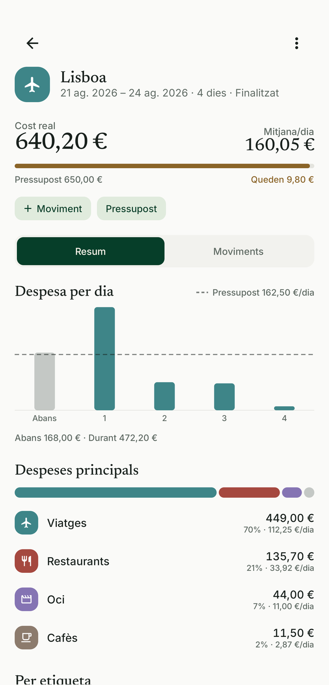
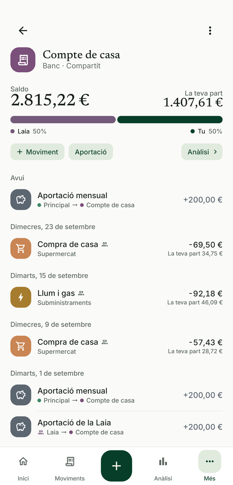
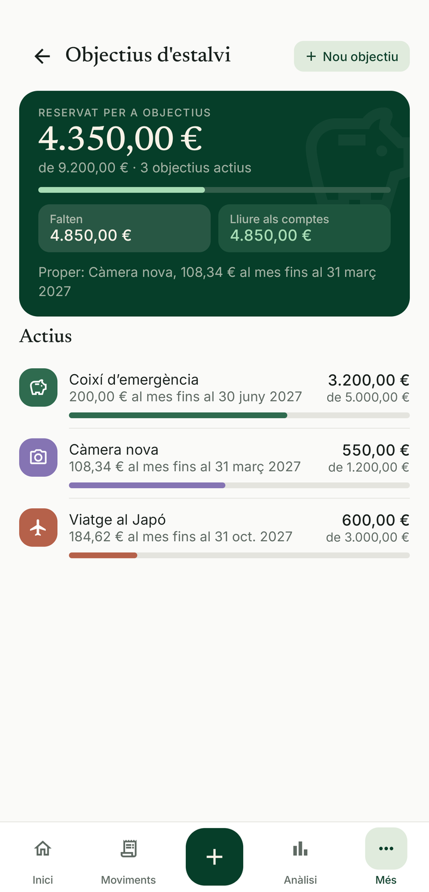
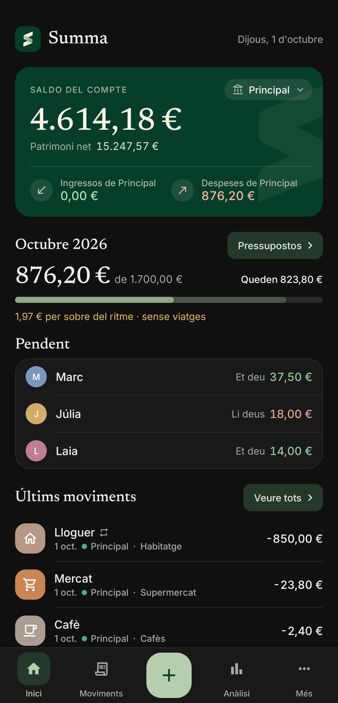

# Summa

Summa is a functional, local-first Android personal finance app for one person. It is Catalan-first, euro-only, and designed to keep financial meanings explicit without requiring a hosted account, bank connection, or cloud database.

> [!IMPORTANT]
> Android is the working product, at version 1.0.1 and in daily use by its maintainer. Summa remains a personal project: investment valuation and cross-device synchronization are not implemented, and it is not on any app store. A signed APK is attached to the repository's [Releases](https://github.com/Nilpomarol/Summa/releases) for sideloading on Android 8.0 or later.

## What it tracks

Summa distinguishes concepts that many expense trackers collapse together:

- **Account flow** — what physically entered or left an account.
- **Actual income/expense** — what economically belongs to the app owner.
- **Shared expenses and debt** — economic splits and derived balances between people.
- **Shared accounts** — physical balance, ownership share, contributions/withdrawals, and expense allocation.
- **A monthly budget** — one total split into category parts that always add up to it, with pace, forecast and what is left per day, measured against canonical actual spending.
- **Savings goals** — reservations of existing money without inventing ledger activity.
- **Trips, categories, tags, recurring activity, and analysis** — context over the same financial truth.

## Current Android capability

- personal and shared accounts;
- expenses, income, transfers, refunds, settlements, contributions, and withdrawals;
- people, splits, shared income allocation, and derived debt;
- recurring payments and income as expected movements: a reminder ahead of the date, on the day and when one is missed, confirmed in one sheet or matched to a movement recorded by hand;
- a monthly budget in parts, with its history kept month by month, planned saving, yearly category limits and trip budgets;
- trips with spending per day, categories with subcategories, tags, search, and filters;
- savings goals backed by dedicated accounts or manual allocations;
- a home page for the month and an analysis page for where money goes, the month's pace, the last twelve months and net worth;
- System/Light/Dark themes and notifications that each can be turned off;
- automatic backups to a folder of your choice, pruned to the recent ones, and restore that first backs up what it replaces.

The UI follows the **Personal Compass** direction: warm, private, precise, and evidence-led. Financial meaning is labelled rather than conveyed by colour alone.

## Demo

Every screenshot shows invented data: a year of a made-up person's ledger generated by [`tools/create_portfolio_demo_db.py`](tools/create_portfolio_demo_db.py) and loaded into a separate install of the app. The repository contains none of the maintainer's real financial data.

<table>
  <tr>
    <td></td>
    <td></td>
    <td></td>
    <td></td>
  </tr>
  <tr>
    <td align="center">Home</td>
    <td align="center">Monthly budget</td>
    <td align="center">Analysis</td>
    <td align="center">Recurring</td>
  </tr>
  <tr>
    <td></td>
    <td></td>
    <td></td>
    <td></td>
  </tr>
  <tr>
    <td align="center">Trip</td>
    <td align="center">Shared account</td>
    <td align="center">Savings goals</td>
    <td align="center">Dark theme</td>
  </tr>
</table>

## Architecture

Current production architecture:

```text
Compose UI
    ↓
ViewModel / screen state
    ↓
repository or small domain rule
    ↓
SQLDelight
    ↓
SQLite
```

`shared/` contains the schema, migrations, genuinely canonical finance SQL, focused golden vectors, and design tokens. The current `windows/` project is a .NET validation harness; a Windows product has not started.

There is no server in the current product. Future Windows and synchronization ideas are deliberately separated from current architecture so they do not force speculative abstractions into Android.

## Technology

| Area | Technology |
| --- | --- |
| Android | Kotlin, Jetpack Compose, Material 3, coroutines, StateFlow |
| Persistence | SQLite, SQLDelight |
| Shared finance contract | SQL schema, migrations, canonical queries, JSON golden vectors |
| Contract validation | .NET 8, C#, Microsoft.Data.Sqlite, Dapper, MSTest |
| Automation | Gradle, Python validation scripts, GitHub Actions |

## Financial correctness

- Money is stored as integer euro cents.
- Balances, account flow, actual income/expense, debt, trip actuals, and goal progress are derived from canonical SQL.
- Schema changes use forward migrations.
- Focused procedural finance rules use shared golden vectors where exact parity matters.
- Risky but valid actions warn; structurally invalid ledger states remain errors.
- Normal finance deletion is recoverable soft deletion.

## AI-developed, human-directed

Summa has been developed using OpenAI Codex and Anthropic Claude Code. The maintainer defines product behaviour, approves financial semantics, tests real flows, and decides which generated changes are accepted.

Repository-level agent guidance lives in [`AGENTS.md`](AGENTS.md). Optional specialist configurations are intentionally minimal: a reviewer and a schema steward for changes where they materially reduce risk.

## Build and test

Requirements: JDK 17, Android SDK 35 / Build Tools 35.0.0, and .NET 8 SDK when validating the shared contract.

Android, from `android/`:

```powershell
.\gradlew.bat :app:assembleDebug
.\gradlew.bat :app:testDebugUnitTest
```

.NET contract harness, from the repository root:

```powershell
dotnet test .\windows\GestorFinances.Tests\GestorFinances.Tests.csproj
```

## Repository map

```text
android/       Native Android application and tests
windows/       .NET shared-contract validation harness
shared/        Schema, migrations, canonical finance SQL, golden vectors, tokens
docs/          Current product/architecture/design/data docs and backlog
docs/future/   Non-binding future Windows/sync notes
tools/         Validation and demo-data scripts
```

## Documentation

- [Product](docs/product.md) — current capability and durable finance meanings
- [Architecture](docs/architecture.md) — current Android architecture and boundaries
- [Data contract](docs/data-contract.md) — current schema/finance contract
- [Design](docs/design.md) — durable Android design principles
- [Backlog](docs/backlog.md) — active work
- [Agent guide](AGENTS.md) — repository-level coding-agent instructions

Future notes are intentionally non-binding and live under [`docs/future/`](docs/future/).

## Scope

Summa is intentionally single-owner, euro-only, Catalan-first, and local-first. It currently has no authentication, hosted account, live bank connection, implemented Windows UI, investment-price feed, or cross-device synchronization.

No open-source licence has been selected yet; unless a licence is added, the source should not be assumed to grant reuse or redistribution rights.
